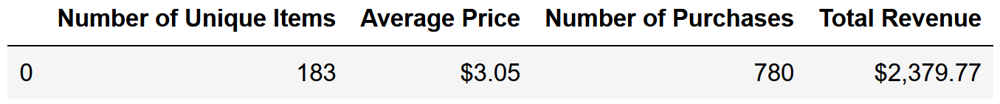
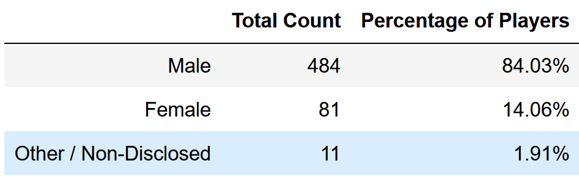
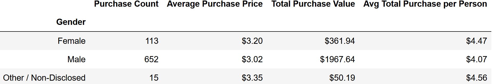
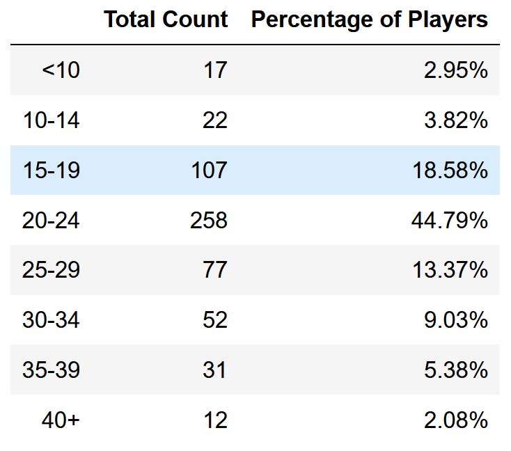
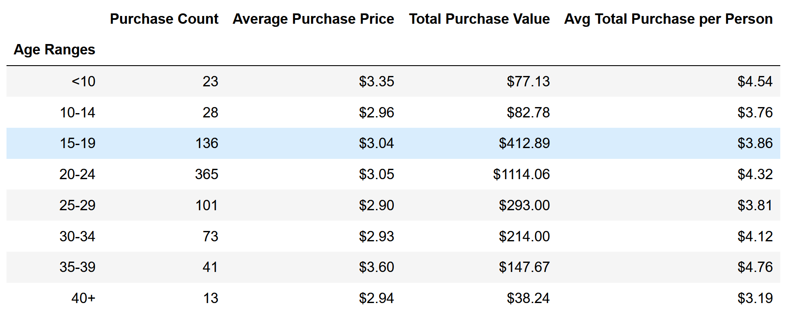
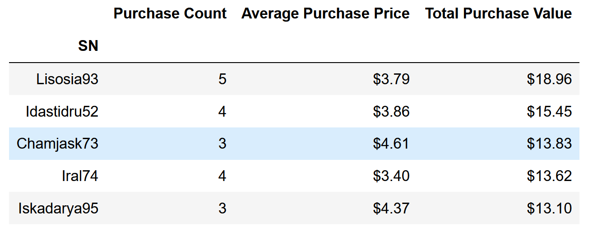
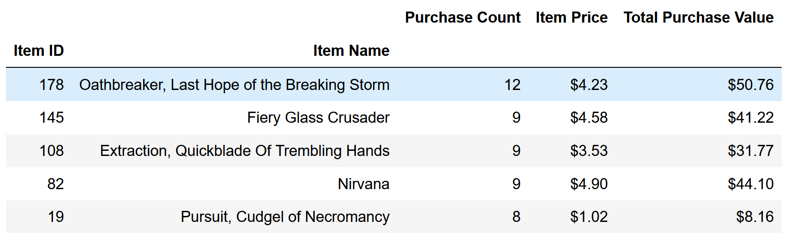
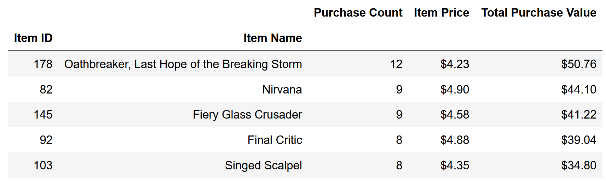

# Heroes of Pymoli Data Analysis
### Background
I have given access to the data for the most recent fantasy game Heroes of Pymoli.

Like many others in its genre, the game is free-to-play, but players are encouraged to purchase optional items that enhance their playing experience. As a first task, I was asked to generate a report that breaks down the game's purchasing data into meaningful insights.

Purshase data was provided as csv file. It is saved [here](https://github.com/kanamoore/pandas-challenge/tree/master/Resources)

### Observable Trends
* Out of total 573 players, the vast majority are male (84%). 

* The best represented age bracket in the data is 20-24 years(45%), followed by 15-19(18.58%) and 25-29(13.37%). 

* Age group 20-24 spends the most money, total purchase value of $1,114.06 and average puchase of $4.32 per person. However, age group 35-39 has the highest average purchase of $4.76 per person and total purchase value of $147.67.

### Read data
```
# Dependencies and Setup
import pandas as pd

# File to Load (Remember to Change These)
file_to_load = "Resources/purchase_data.csv"

# Read Purchasing File and store into Pandas data frame
purchase_data = pd.read_csv(file_to_load)
purchase_data.head()
```

### Player Count - Total Number of Players
```
# Count number of unique SN
player_count = purchase_data["SN"].nunique()

# Save as a Data Frame for cleaner formatting
player_count = pd.DataFrame({"Player Count":[player_count]})

# Display the summary
player_count
```


### Purchasing Analysis (Total)

* Number of Unique Items
* Average Purchase Price
* Total Number of Purchases
* Total Revenue

```
# Count number of unique item
item_count = purchase_data["Item ID"].nunique()

# Caluculate average price 
average_price = purchase_data["Price"].mean()

# Count number of transactions using Purchase ID
purchase_count = purchase_data["Purchase ID"].count()

# Caluculate total revenue by adding all prices
total_revenue = purchase_data["Price"].sum()
```
```
# Create a summary
purchasing_summary = pd.DataFrame({"Number of Unique Items":[item_count],
                                    "Average Price":[average_price],
                                    "Number of Purchases": [purchase_count],
                                    "Total Revenue" : [total_revenue]})

# Change format to currency
purchasing_summary[["Average Price","Total Revenue"]] \
= purchasing_summary[["Average Price","Total Revenue"]].applymap("${:,.2f}".format)

# Display the summary
purchasing_summary
```


### Gender Demographics

* Percentage and Count of Male Players
* Percentage and Count of Female Players
* Percentage and Count of Other / Non-Disclosed

```
# To get the unique number of players(SN), remove duplicates
sn_unique = purchase_data.drop_duplicates(subset = "SN")

# Count unique number of male, female and other players
gender_count = sn_unique["Gender"].value_counts()

# Caluculate percentage of male, female and other player
gender_percentage = gender_count / sn_unique["Gender"].count() * 100
```
```
# Create a summary 
gender_summary_df = pd.DataFrame({"Total Count": gender_count,
                                  "Percentage of Players" : gender_percentage})

# Change format to percentage
gender_summary_df["Percentage of Players"] = gender_summary_df["Percentage of Players"].map("{0:.2f}%".format)

# Display the summary
gender_summary_df
```


### Purchasing Analysis (Gender)

* The below each broken by gender
  * Purchase Count
  * Average Purchase Price
  * Total Purchase Value
  * Average Purchase Total per Person by Gender
  
```
# Count number of purchases by gender (use purchase_data df to calculate whole data)
purchase_count_gender = purchase_data.groupby("Gender")["Item Name"].count()

# Caluculate average price spent by gender
average_price_gender = purchase_data.groupby("Gender")["Price"].mean()

# Caluculate total price spent by gender
total_price_gender = purchase_data.groupby("Gender")["Price"].sum()

# Caluculate aveage price spent by person (use gender_count to get unique SN ID)
average_total_gender = total_price / gender_count
```
```
# Create a summary
purchase_summary_df = pd.DataFrame({"Purchase Count": purchase_count_gender,
                                    "Average Purchase Price" : average_price_gender,
                                    "Total Purchase Value": total_price_gender,
                                    "Avg Total Purchase per Person" : average_total_gender})
# Change format to currency
purchase_summary_df[["Average Purchase Price","Total Purchase Value","Avg Total Purchase per Person"]] \
= purchase_summary_df[["Average Purchase Price","Total Purchase Value","Avg Total Purchase per Person"]] \
.applymap("${:.2f}".format)

# Show the summary
purchase_summary_df
```


### Age Demographics

* The below each broken into bins of 4 years (i.e. &lt;10, 10-14, 15-19, etc.)
  * Purchase Count
  * Average Purchase Price
  * Total Purchase Value
  * Average Purchase Total per Person by Age Group
  
```
# Establish bins for ages and age group(label)
bins = [0,9,14,19,24,29,34,39,100]
age_group = ["<10","10-14","15-19","20-24","25-29","30-34","35-39","40+"]

# Categorize the existing players using the age bins. 
sn_unique["Age Range"] = pd.cut(sn_unique["Age"], bins, labels = age_group)
```
```
# Count # of purchase by age
purchase_count_age = sn_unique["Age Range"].value_counts()

# Caluculate percent of players by age
percentage_player_age = (purchase_count_age / sn_unique["SN"].count()) * 100
```
```
# Create age summary
age_summary_df = pd.DataFrame({"Total Count" : purchase_count_age,
                               "Percentage of Players" : percentage_player_age})

# Sort by index 
age_summary_df = age_summary_df.sort_index()

# Change the format to percentage
age_summary_df["Percentage of Players"] = age_summary_df["Percentage of Players"].map("{:.2f}%".format)

# Show the summary
age_summary_df
```


### Purchasing Analysis (Age)
    * Bin the purchase_data data frame by age
    * Run basic calculations to obtain purchase count, avg. purchase price, avg. purchase total per person etc. in the table below
    * Create a summary data frame to hold the results
    
```
# Categorize the existing players using the age bins. 
purchase_data["Age Ranges"] = pd.cut(purchase_data["Age"], bins, labels = age_group)
purchase_age_count = purchase_data["Age Ranges"].value_counts()

# Calculate average purchase price by age
average_price = purchase_data.groupby("Age Ranges")["Price"].mean()

# Calculate total purchase value by age
total_purchase_age = purchase_data.groupby("Age Ranges")["Price"].sum()

# Calculate average total purchase per person
average_purchase_age = total_purchase_age / purchase_count_age
```
```
# Create summary
purchase_summary_age = pd.DataFrame({"Purchase Count" : purchase_age_count,
                                     "Average Purchase Price" : average_price,
                                     "Total Purchase Value" : total_purchase_age,
                                     "Avg Total Purchase per Person" : average_purchase_age})


# Change the format to currency
purchase_summary_age[["Average Purchase Price","Total Purchase Value","Avg Total Purchase per Person"]] \
= purchase_summary_age[["Average Purchase Price","Total Purchase Value","Avg Total Purchase per Person"]] \
.applymap("${:.2f}".format) 

# Rename the axis to show data label "Age Ranges"
purchase_summary_age = purchase_summary_age.rename_axis("Age Ranges")

# Display the summary 
purchase_summary_age
```



### Top Spenders

* Identify the the top 5 spenders in the game by total purchase value, then list (in a table):
  * SN
  * Purchase Count
  * Average Purchase Price
  * Total Purchase Value
  
```
# Count the purchase count(frequency) by user
purchase_count_user = purchase_data.groupby("SN")["Price"].count()

# Caluculate average price spent by user
purchase_price_user = purchase_data.groupby("SN")["Price"].mean()

# Calculate total price spent by user
total_purchase_user = purchase_data.groupby("SN")["Price"].sum()

# Create a summary
user_summary = pd.DataFrame({"Purchase Count" : purchase_count_user,
                             "Average Purchase Price": purchase_price_user,
                             "Total Purchase Value": total_purchase_user})

# Sort by total purchase value
user_summary = user_summary.sort_values(by = "Total Purchase Value",ascending = False)

# Change the format to currency
user_summary[["Average Purchase Price","Total Purchase Value"]] \
= user_summary[["Average Purchase Price","Total Purchase Value"]].applymap("${:.2f}".format)

# Display the summary
user_summary.head()
```


### Most Popular Items

* Identify the 5 most popular items by purchase count, then list (in a table):
  * Item ID
  * Item Name
  * Purchase Count
  * Item Price
  * Total Purchase Value
```
# Retrieve the most popular items by item ID count
most_purchased_item = purchase_data.groupby(["Item ID","Item Name"])["Price"].count()

# Retrive the total sales amount by item ID and Item Name
popular_item = purchase_data.groupby(["Item ID","Item Name"])["Price"].sum()

# Retrive the item price
item_price = popular_item / most_purchased_item
```
```
# Create a summary
item_summary = pd.DataFrame({"Purchase Count": most_purchased_item,
                             "Item Price" : item_price,
                             "Total Purchase Value": popular_item})

# Sort by purchase count
item_summary = item_summary.sort_values("Purchase Count", ascending = False)

# Sort by total purchase value (do this before changing the format to currency to avoid changing types to string)
highest_purchase_value = item_summary.sort_values("Total Purchase Value", ascending = False)

# Change the format to currency
item_summary[["Item Price", "Total Purchase Value"]] \
= item_summary[["Item Price", "Total Purchase Value"]].applymap("${:.2f}".format)

# Display the summary
item_summary.head()
```


### Most Profitable Items

* Identify the 5 most profitable items by total purchase value, then list (in a table):
  * Item ID
  * Item Name
  * Purchase Count
  * Item Price
  * Total Purchase Value
  
 ```
 # Change the format to currency
highest_purchase_value[["Item Price", "Total Purchase Value"]] \
= highest_purchase_value[["Item Price", "Total Purchase Value"]].applymap("${:.2f}".format)

# Show the result
highest_purchase_value.head()
```



